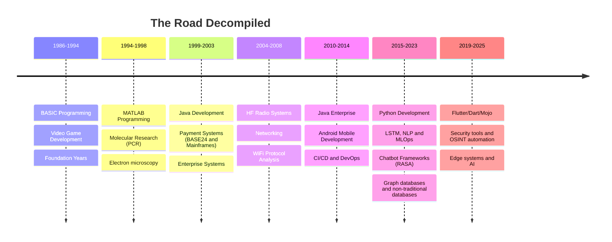

## 🔧 What I Build

- **Cognitive Enhancement Systems**: AI tools that amplify human decision-making and learning
- **Edge AI Solutions**: Lightweight, efficient AI systems for real-time data processing
- **Enterprise Solutions**: Scalable products for complex organizational challenges
- **Data Pipelines**: Advanced data processing and analysis frameworks for diverse applications
- **Secure Communications**: Wired and wireless systems for secure data transmission and cryptography

## 🌟 Skills and Expertise

- **Technical Leadership**: Executive technical leaders in R&D and strategic planning
- **Fullstack AI Platform Developer**: Building end-to-end AI solutions from data ingestion to deployment
- **Data Wayfinding**: Identifying unconventional data sources to solve complex problems
- **Security Research**: Vulnerability analysis, OSINT automation, and threat intelligence
- **Global Product Strategy and Implementation**: Over two decades of experience in global product development and implementation in numerous countries, and diverse industries.

## Publications
- **The Minimalist's Index** (https://medium.com/@wall-d/the-minimalists-index-a116d64ad1e6)

## GitHub Stats

## 🛠️ Technologies I Use

)

## *"Tion'ad balyc hibir o'r, cuyir haar dinuir."*

